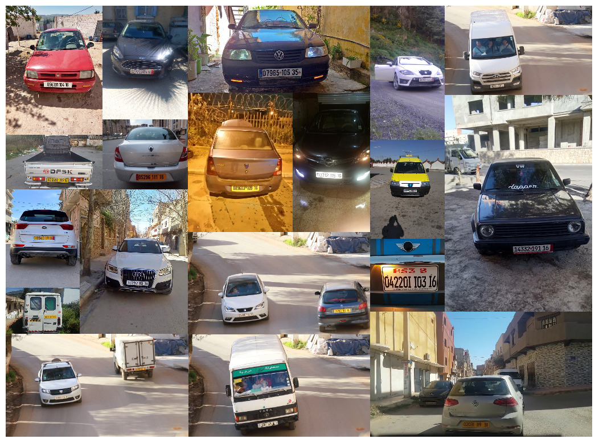
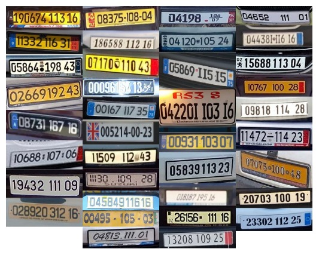

# License Plates of Algeria Dataset (Les plaques minéralogique algeriennes)
## Detection

We collected an image and video dataset that we captured in the municipality of Draria in Algeria using a fixed camera. Then, we augmented our dataset with public images from websites that can be viewed on the Internet (such as ”google images” 1, ”facebook marketplace” 2 and ”Ouedkniss” 3). The vehicle objects of our dataset present a great variability of points of view and insights. So, we built a training set of 2408 images, and a test set of 1000 images.

<p align="center"> 

</p>

## Recognition

For the license plate recognition part, we collect the plates extracted during the detection in a Dataset. The latter contains a learning set of 1775 plates, and a test set of 404 plates. They have been carefully and manually annotated with license plate characters to allow accurate assessment of OCR.

<p align="center"> 

</p>

note: this is a sample of the dataset. For a full dataset contact us (mouad.bensouilah@gmail.com).
## Citation 

Please cite LPA-Dataset in your publications if it helps your research:

```
@inproceedings{bensouilah2021alpr,
  title={An ALPR System-based Deep Networks for the Detection and Recognition.},
  author={Bensouilah, Mouad and Zennir, Mohamed Nadjib and Taffar, Mokhtar},
  booktitle={ICPRAM},
  pages={204--211},
  year={2021}
}

```

